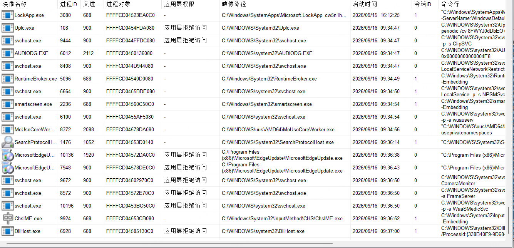
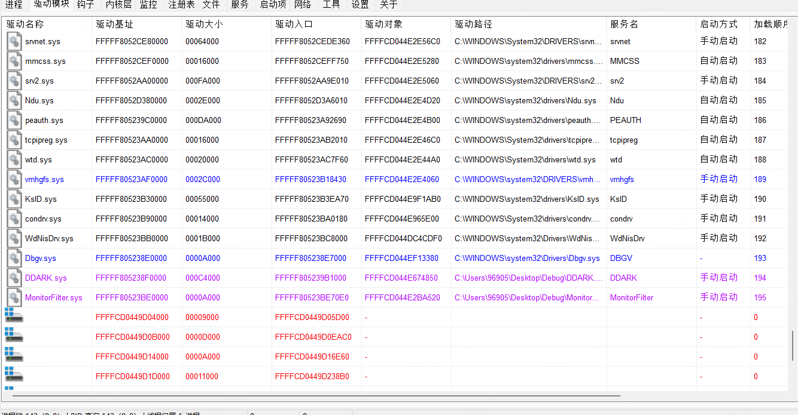
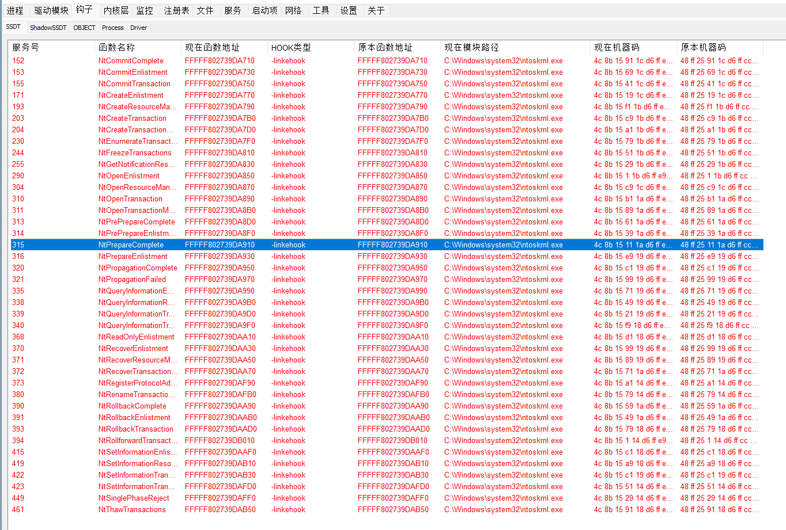
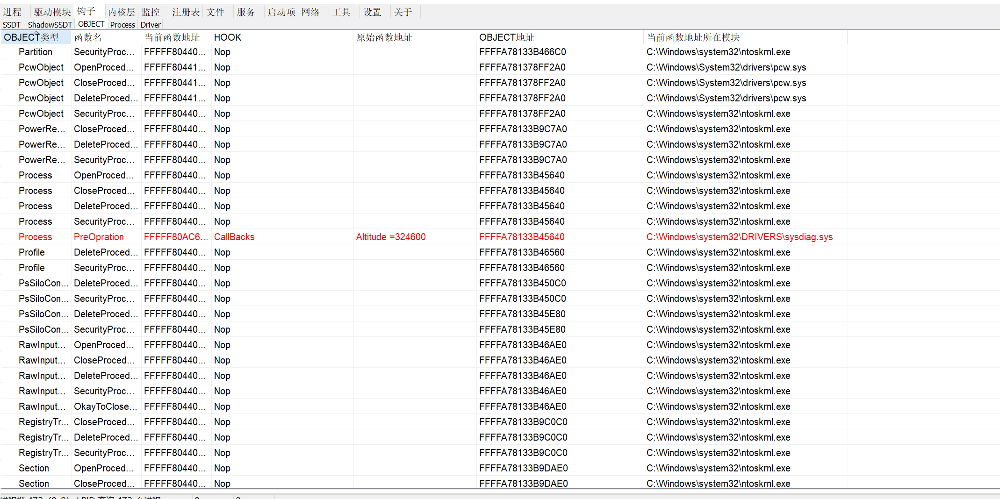
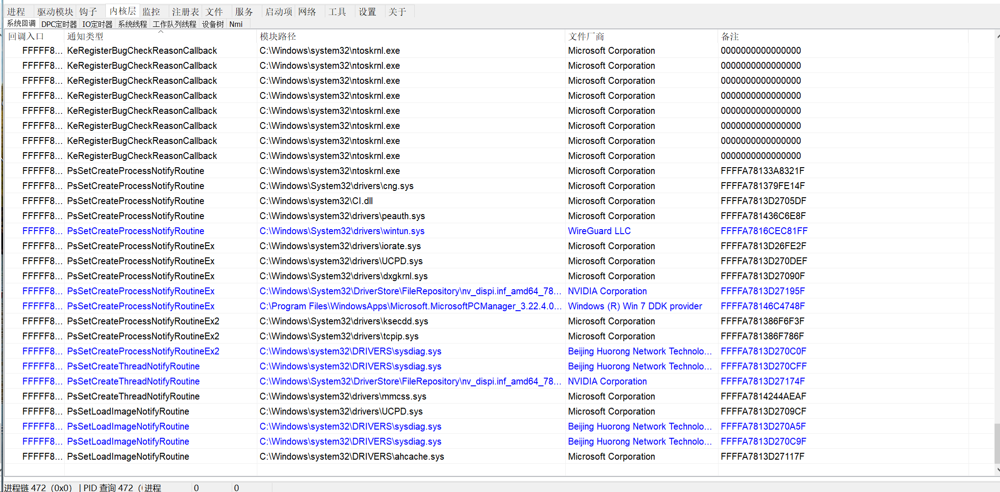
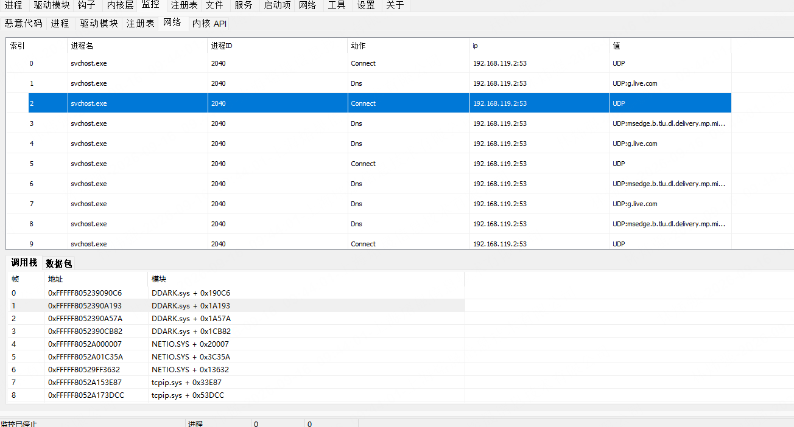
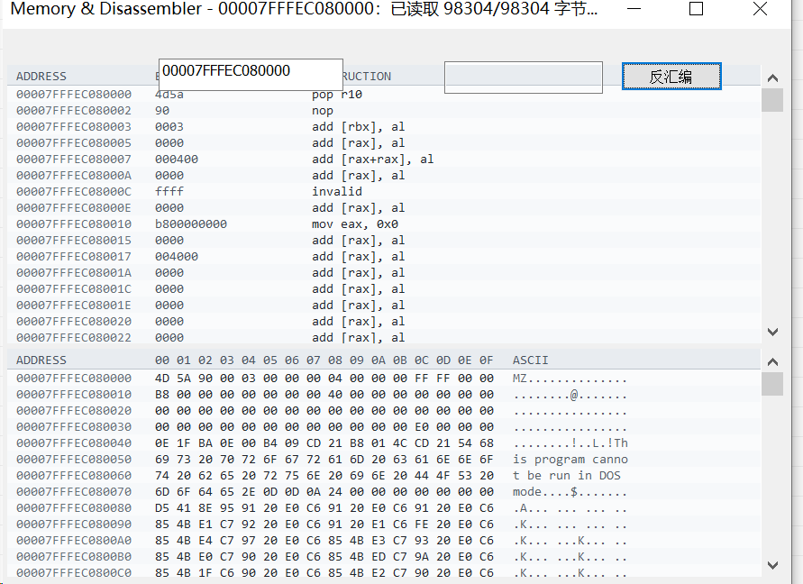
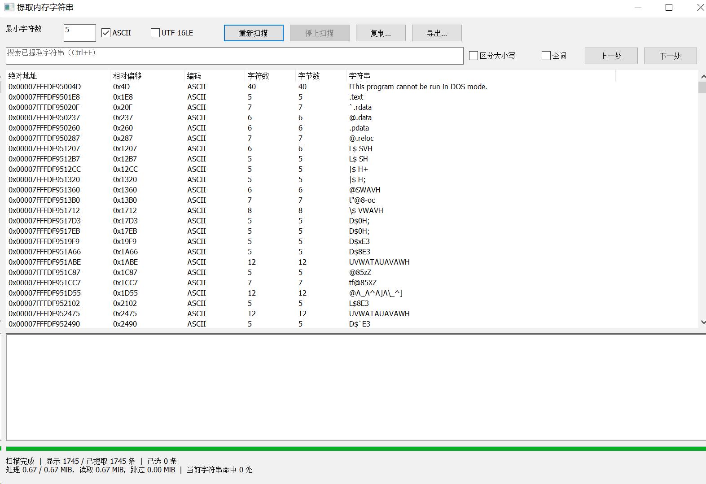

# WQARK · 内核级 ARK 工具

Windows 内核级 Anti-RootKit 工具。直接读取内核内存与未公开结构，用于查看和处理系统中的隐藏对象、内核钩子、内核回调与内核 API 调用。

**支持系统**：Windows 10 1709 — Windows 11 26H1（build 28000）
**运行环境**：x64，管理员权限，驱动需自行签名
**当前版本**：1.0.0.10
**反馈群**：811651711　**反馈**：3992383998

---

## 功能

### 进程与线程

进程列表包含进程对象地址、父进程、映像路径、完整命令行、启动时间、会话 ID、应用层权限状态，以及文件厂商与描述。

| 分类 | 功能 |
|---|---|
| 进程 | 遍历进程、遍历隐藏进程、挂起 / 恢复、结束、注入（支持受权限保护的进程）、进程校验 |
| 线程 | 遍历线程、遍历隐藏线程、挂起 / 恢复、结束 |
| 模块 | 遍历模块、拷贝模块内存、隐藏模块、卸载模块 |
| 内存 | 遍历内存区域、修改保护属性、提取内存字符串（搜索、导出、多选复制） |
| 句柄 | 遍历句柄、关闭句柄 |

### 驱动与模块

支持枚举隐藏驱动、断链驱动与内存加载（MAP）驱动，并给出基址、大小与映像信息。

下图底部无驱动路径、无服务名的条目即为脱离系统记录的驱动。

| 分类 | 功能 |
|---|---|
| 枚举 | 遍历驱动、遍历隐藏驱动、遍历断链驱动、遍历内存加载（MAP）驱动（支持多块内存区域） |
| 内存 | 拷贝驱动模块、拷贝内核内存、查看 IRP 函数 |
| 字符串 | 提取驱动字符串 |
| 痕迹 | 驱动加载与卸载痕迹 |
| 校验 | 驱动校验 |

### 内核钩子

读取 SSDT、Shadow SSDT、对象钩子、进程钩子与驱动钩子，列出钩子类型、原始函数地址、当前函数地址及其所在模块，支持恢复。

覆盖的钩子类型：Inline、IAT、EAT。

### 内核对象与回调

系统回调按进程、线程、模块、注册表、关机、蓝屏、文件分类列出，含注册模块路径与厂商归属，支持删除。

| 分类 | 功能 |
|---|---|
| 系统回调 | 进程 / 线程 / 模块 / 注册表 / 关机 / 蓝屏 / 文件回调的遍历与删除 |
| DPC / IO 定时器 | 遍历、删除、开启、停止、校验 |
| 系统线程 / 工作线程 | 遍历、挂起、恢复、结束、校验 |
| 设备树 | 遍历、Attach 设备删除 |
| NMI | 遍历、删除 |
| 内存 | 内核内存扫描 |

### 监控

监控事件均可展开查看完整的内核调用栈。

**内核 API 监控**：监控 34 个内核 API 的调用，按 9 个分组组织。

| 分组 | 数量 | 代表性 API |
|---|---|---|
| 连续物理内存 | 5 | `MmAllocateContiguousMemory`、`MmFreeContiguousMemory` |
| MDL 页面申请 | 4 | `MmAllocatePagesForMdl`、`MmFreePagesFromMdl` |
| MDL 映射 | 5 | `MmMapLockedPages`、`MmUnmapLockedPages` |
| 物理地址映射 | 3 | `MmMapIoSpace`、`MmUnmapIoSpace` |
| Section 映射 | 3 | `MmMapViewInSystemSpace`、`MmUnmapViewInSystemSpace` |
| 预留映射地址 | 3 | `MmAllocateMappingAddress`、`MmFreeMappingAddress` |
| MDL 保护 | 1 | `MmProtectMdlSystemAddress` |
| 池申请 | 6 | `ExAllocatePool2/3`、`ExAllocatePoolWithTag`、`ExFreePoolWithTag` |
| Process / Thread | 4 | `PsLookupProcessByProcessId`、`MmCopyVirtualMemory`、`PsCreateSystemThread`、`KeStackAttachProcess` |

每条事件记录时间、进程 PID、线程 TID、API、关键参数、返回值与 IRQL，支持按 API 勾选与过滤，并可展开调用栈。

> 内存加载的驱动、无文件落地的 shellcode，最终都要调这批 API。
> 它们不会在文件系统留痕，但会在这里留痕。

其余监控项：内核 shellcode 运行、无模块驱动定位、进程创建、线程创建、注入操作、驱动创建、驱动镜像文件捕获、注册表行为、网络行为（调用栈、流上下文、TCP / UDP 数据预览）、文件行为。

### 内存

读取进程内存与内核内存并反汇编，支持地址跳转、返回导航与分页浏览，可与内存修改联动。

内存字符串提取支持按最小长度与编码（ASCII / UTF-16LE）扫描、搜索（区分大小写、全词匹配）、多选复制与导出。

### 文件与网络

| 分类 | 功能 |
|---|---|
| MiniFilter | 回调遍历 |
| 文件监控 | 文件访问监控（读 / 写 / 删除 / 重命名 / 属性 / 创建，支持进程 ID、进程路径、目标路径三种过滤）、文件回调查询 |
| WFP | WFP 回调遍历、WFP Filter 遍历 |
| 网络 | 遍历当前网络连接 |

### 其他

- **自动更新**：内置检查更新与下载。
- **关于页**：版本、构建信息、更新入口。

---

## 更新日志

### 1.0.0.10 · 2026-09-16

- 修复从进程模块及内存列表打开反汇编时，大模块或大区域因读取长度超限而无法显示的问题。默认读取最多 0x1000 字节，不足一页使用原长度，读取长度仍可手动调整。

### 1.0.0.9 · 2026-09-15

- 补充、修正 25H2 / 26H1 内核适配，更新 SSDT / ShadowSSDT 名称映射。
- 修复 WFP 回调与过滤器枚举的兼容性及数据显示问题。
- 修复 26H1 内存池扫描导致的蓝屏问题。
- 改善驱动对象枚举的引用、锁与异常清理，保留断链驱动恢复及内存扫描。
- 修正进程列表异常标记、签名验证与内存反汇编读取相关问题，文件回调增加反汇编入口。

### 1.0.0.8 · 2026-09-13

- 静态链接 MFC，不再需要运行库 DLL。
- 启动时自动清理旧版本遗留 DLL。
- Release 版增加管理员权限声明。

### 1.0.0.2

- 添加内存加载远程线程注入、添加 HOOK 注入。

---

## 说明

- 适配针对已核验的系统版本与样本；未列出的功能及后续系统更新不作全量兼容承诺。
- 本工具为内核级程序，加载驱动前请自行完成签名。
- 若发现 bug 或有其他建议，欢迎通过上方反馈渠道联系。
